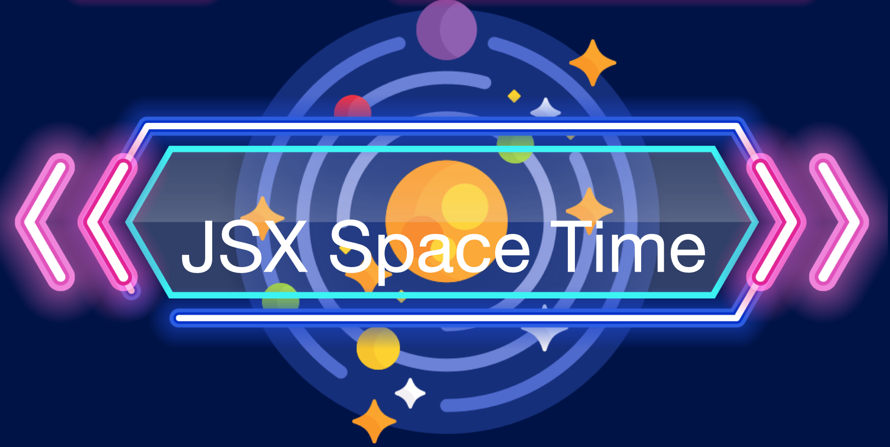

* JSX Space Time is an app that helps mainstream video broadcast from PBS. Users can watch in depth discussions about the nature of reality with astrophysicist Matt O'Dowd, PhD. 

* Technologies used to build the site are Ruby on Rails, React, and Redux. Ruby on Rails provides backend functionalities needed for an MVC framework to function and integrated is postGreSql that stores information as a database. React/Redux is used for frontend UI. React/Redux is used to fetch information to the frontend that will be rendered for the user. 

* One important feature that JSX Space Time brings to the user is the ability to watch videos that peak their interest on the platform. Users can also click on the youtube button on the video that allows them to become subscribers to the channel. This feature was design to embed videos from another site to allow users to obtain more information if they so choose to. The challenges that this brought was building all the relavent code needed without relying on 3rd party platforms such as AWS to stream videos to the user. Instead `ReactPlayer` was used to avoid having to use external platforms. 

* A second important feature used is the modal feature when users sign in. Upon sign in a user can either sign in if they are reqistered with JSX Space Time or sign up for an account. The modal feature is a more centralized hub that the user can interact with for a more UI freindly experience. 

* Future implementations to JSX Space Time will be to allow users to create a 'My List' which allows them to save specific videos that they wish to watch. 
